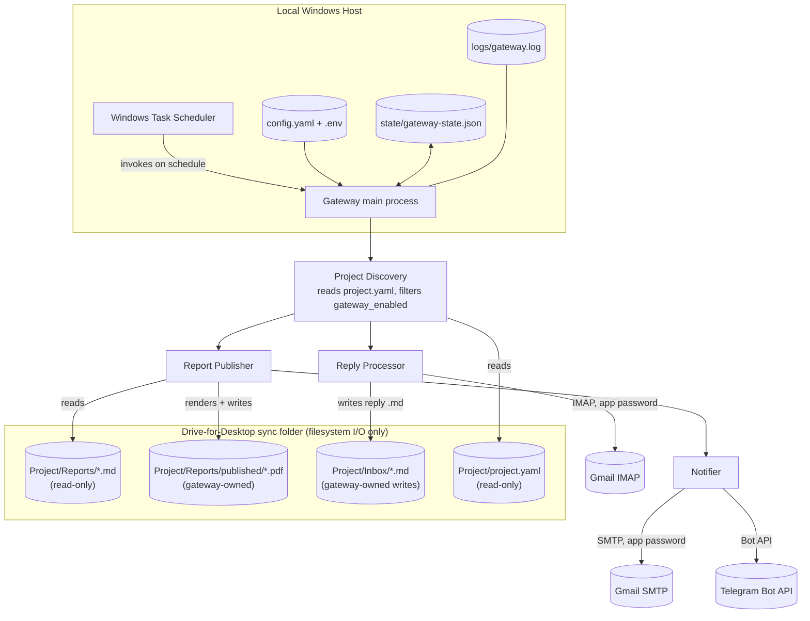

# AI Workflow Gateway — Design

Status: draft, for approval before implementation. No code has been written yet.

---

## 1. Overall Architecture

The gateway is a **stateless, run-to-completion Python script**, not a daemon or service. Windows Task Scheduler invokes it on a fixed interval (e.g. every 5–15 minutes); each invocation does one bounded pass over all opted-in projects and exits. This is the simplest model that satisfies "not dependent on Cowork's scheduler or the app being open": there is no process to keep alive, no crash-recovery logic beyond "the next scheduled run picks up where the last one left off," and no risk of two long-running instances drifting out of sync with each other. All durability comes from the state file (§5), not from an in-memory process.

Each run does two independent passes, in order:

1. **Publish pass** — for every opted-in project, find Markdown reports in `Reports/` that haven't been published yet, render them to PDF, write the PDF to `Reports/published/`, and send the email + Telegram notification.
2. **Reply pass** — one IMAP session against the single shared mailbox, fetched once per run (not per project), parses the project tag out of each new message's subject, and writes a Markdown file into the right project's `Inbox/`.

The two passes are independent and failure in one must not block the other. Within a pass, failure on one project or one report must not block the others — each unit of work is wrapped so a single bad file or a single malformed email is logged and skipped, not fatal to the run.

The gateway does no AI reasoning and never touches `Reports/` source files or `State/State.md` — it only reads `Reports/`, `project.yaml`, and IMAP, and only writes to `Reports/published/`, `Inbox/`, and its own state file.

### Design principles applied
- **KISS / no daemon**: a scheduled batch job is simpler to reason about, debug, and restart than a long-running service on a machine that isn't a server.
- **Idempotent by construction**: every write is gated by a state check ("have I already done this?"), so re-running after a crash, a missed schedule, or a manual re-trigger is always safe.
- **Config over code**: which projects are active, and all credentials/paths, live in config — never hardcoded, never inferred by scanning for "every folder that looks like a project."

---

## 2. Directory Structure

### Drive-synced tree (per project, existing structure, brief-mandated)

```text
<Workspace Root>/                      (Google Drive for Desktop sync folder — see 2026-08-07 amendment below for career-agent's local-disk exception)
    <Project>/
        Inbox/                         Cowork reads this; gateway writes reply .md files here
        Reports/                       Cowork writes canonical .md reports here — gateway: read-only
            published/                 gateway-owned; PDFs (and later HTML) live here only
        State/
            State.md                   Cowork's own state file — gateway never touches this
        Archive/                       Cowork-owned; gateway never touches this
        project.yaml                   Cowork/user-owned config; gateway reads, never writes
```

`Reports/published/` is the only new folder introduced under `Reports/`. The gateway treats everything else under `Reports/` (including `Reports/archive`, which some projects already populate) as read-only.

### Local runtime tree (co-located under this project, NOT synced to Drive, NOT committed to git)

Single Python app, single checkout — no second Windows-native clone. Task Scheduler shells into this WSL distro to run it in place:

```text
ai-workflow-gateway/
    DESIGN.md                          this document (tracked in git)
    .gitignore                         excludes runtime/ entirely
    gateway/                           application source (tracked, once implementation starts)
    runtime/                           mutable, machine-local — gitignored, never committed
        venv/                          dedicated virtualenv: pinned deps, independent of system Python
        config.yaml                    global settings (see §3)
        .env                           secrets only: Gmail app password, Telegram bot token — chmod 600
        state/
            gateway-state.json         single state file: per-project publish state + IMAP watermark (see §5)
        logs/
            gateway.log                rotating log file
```

One state file, not one-per-project-plus-mailbox: a single JSON document with a `projects` section and a `mailbox` section is one atomic write surface instead of several, which is less to keep consistent for no real benefit at this scale.

Task Scheduler's Action is one line:
```text
wsl.exe -d <Distro> -- /home/.../ai-workflow-gateway/runtime/venv/bin/python -m gateway.main --config /home/.../ai-workflow-gateway/runtime/config.yaml
```
Absolute interpreter path and an explicit `--config` path, because non-interactive invocations don't source shell rc files or assume a cwd. `workspace_root` in `config.yaml` points at the Drive-for-Desktop sync folder via its WSL mount (`/mnt/c/...`), so file access stays plain filesystem I/O. To verify once Phase 0 runs end-to-end: that `wsl.exe` propagates the inner process's exit code to Task Scheduler's history, and whether the distro reliably auto-starts under "run whether logged on or not" (default to "only when logged on" until proven).

**Gateway state deliberately lives outside the Drive-synced tree.** The brief allows either placement; keeping it local avoids the exact problem the brief warns about for reports — Drive sync latency and eventual consistency — but applied to the gateway's *own* bookkeeping. A state write that must be durable the instant the function returns cannot tolerate "durable in a few seconds," so it doesn't go through Drive. The tradeoff: gateway state is not visible in Drive and not backed up by Drive's versioning. That's acceptable because state is fully reconstructable — worst case (a wiped local state file) is a one-time republish of already-published reports and re-notification of already-processed replies, not data loss, since the gateway never modifies Cowork's source files.

Credentials live only in `runtime/.env`, gitignored, `chmod 600`, and are never written into any file under the Drive-synced tree — satisfying the brief's requirement to keep secrets out of a synced/shared location.

---

## 3. Configuration Model

### Global config (`config.yaml` + `.env`, local only)
- `workspace_root`: absolute path to the Drive-synced workspace folder.
- `smtp_host`, `imap_host`, ports: connection details for the single Gmail account. **TLS is mandatory, not configurable**: IMAPS (993) and SMTP over STARTTLS or SMTPS (465) only — plaintext IMAP/SMTP is never attempted. Certificate verification uses Python's default `ssl` context and is never disabled (no `CERT_NONE`, no `check_hostname=False`), even for debugging.
- `telegram_chat_id`: the one shared chat every project notifies into (see §3 Telegram note below). **Optional** — email is the mandatory channel; if this and `TELEGRAM_BOT_TOKEN` (`.env`) are both blank, Telegram is treated as not configured and silently skipped (logged once at INFO, state marked done rather than retried forever), without affecting email at all.
- `.env`: `GMAIL_ADDRESS`, `GMAIL_APP_PASSWORD`, `TELEGRAM_BOT_TOKEN` — nothing else lives here.

Two fields deliberately **not** in config, and why:
- Poll cadence — Task Scheduler already owns this; a `poll_interval_minutes` field in `config.yaml` wouldn't do anything but could mislead someone into thinking the app self-schedules. One source of truth for cadence, not two that can drift.
- Retry/backoff tuning — the Drive-sync stability check and SMTP/IMAP retry counts are small constants in code, not YAML knobs. Nobody tunes these without a redeploy anyway, so exposing them as config adds a surface (docs, validation, defaults) without removing any real friction. Bump this to config later only if a specific run-without-redeploy need shows up.

### Project discovery
On every run, the gateway lists immediate subdirectories of `workspace_root`. A subdirectory is a **candidate project** if it contains a `project.yaml`. It becomes an **active project** for this run only if that file parses and sets `gateway_enabled: true`. Everything else (missing `project.yaml`, `gateway_enabled: false`/absent, unparseable YAML) is skipped and logged at INFO once per run — never acted on. This is the explicit, manual opt-in the brief requires; the gateway never infers eligibility from folder shape alone.

### Fields the gateway reads from each project's `project.yaml`
- `gateway_enabled` (bool) — the opt-in gate.
- `project` (string) — **reused, not a new field**: existing `project.yaml` files (e.g. career-agent) already carry `project: career-agent` as their identifier. The gateway sources `project_id` (used in the notification subject tag and reply routing) from this existing key rather than requiring a redundant new one. Must be unique across all active projects; a collision at discovery time is a hard error for the *colliding* projects (both skipped, logged loudly) rather than a guess.
- `notify.email_to` — recipient address(es) for this project's notifications.

Telegram has no per-project override: one shared bot, one shared chat (`telegram_chat_id` in global config), for every project — the brief describes a single user monitoring a single chat, so a per-project routing layer would be speculative. Each Telegram message includes the project name in its text so the one chat stays legible across projects; if that stops being enough (e.g. a second person, a second chat) the config model can grow a per-project override then, not now.

The gateway never writes to `project.yaml`. It only reads it.

### How `project.yaml` fields are expected to change once the gateway goes live (Claude's/user's job, not the gateway's)
| Field | Before gateway | After gateway is live |
|---|---|---|
| `gateway_enabled` | absent / `false` | `true` |
| `delivery_mode` | `fallback` | `live` |
| `email_send` | `unavailable` | `available` |
| `project` | already present | unchanged — reused as the gateway's `project_id`, must be unique across workspace |
| `notify.email_to` | (may not exist yet) | set |

The gateway documents this contract but does not perform the flip — it only *reacts* to `gateway_enabled: true` once a human/Claude has made the other edits and considers the project ready.

### Credential storage
Single app password on the Gmail account for both SMTP and IMAP; single Telegram bot token. Both live only in local `runtime/.env`, `chmod 600`, readable only by the gateway process, never inside any file the gateway writes to Drive.

**The gateway uses a dedicated Gmail account, not the user's personal daily-driver account.** Gmail app passwords aren't scoped to a folder/label — they grant full IMAP+SMTP access to the entire mailbox — so a leaked `.env` on a personal account would expose all personal mail (read + send-as). A dedicated account contains that blast radius to gateway traffic only. `notify.email_to` in each `project.yaml` is set to the user's real personal address (the notification *recipient*); the dedicated account is only what the gateway sends from and polls via IMAP, so replies land back in the dedicated account's inbox regardless of which address the user reads from day to day. Switching to OAuth instead was considered and rejected: classic IMAP/SMTP only exposes the broad `https://mail.google.com/` scope, so it wouldn't reduce blast radius, and it would reintroduce the OAuth/cloud-project complexity this design deliberately avoids.

### Multi-project reply routing scheme
1. Every outbound notification email's subject embeds the project tag: `[<project_id>] New report: <report-name> (<date>)`.
2. On the reply pass, for each new IMAP message: strip leading `Re:`/`Fwd:` (and combinations, case-insensitive, repeatable — e.g. `Re: Re: Fwd:`) from the subject, then regex-extract the first `[...]` bracketed token.
3. Match that token against the set of `project_id`s from this run's discovery pass.
4. **Verify the sender before trusting the tag**: the message's `From` must match that project's configured `notify.email_to`. A correct-looking tag from an unexpected sender is treated the same as no match (step 6) — the subject tag alone is not authentication, since anyone who learns or guesses a `project_id` could otherwise inject content into that project's `Inbox/`, which Claude Cowork would then treat as a legitimate human reply on its next run.
5. Tag match + sender match → convert body to Markdown, write to that project's `Inbox/`.
6. No match (tag missing/malformed/unresolvable, or sender doesn't match) → log a WARNING with the message's UID, subject, and sender; do **not** guess a project; do not write anything to any `Inbox/`. The message is still marked processed in the UID watermark (see §5) so the mailbox doesn't reprocess it forever — its content is fully preserved in the IMAP mailbox itself and in the log, so nothing is lost, it's just not auto-routed. This is a deliberate KISS tradeoff called out explicitly rather than left implicit: the alternative (an unbounded "unresolved" retry queue) adds real complexity for a case that should be rare and is always human-recoverable from the mailbox.

---

## 4. Component Diagram



Components:
- **Project Discovery** — enumerates `workspace_root`, parses `project.yaml`, applies the opt-in filter, validates `project_id` uniqueness. Produces the in-memory project registry used by both passes for that run.
- **Report Publisher** — diffs `Reports/*.md` against per-project publish state, renders MD→PDF via a small internal `Publisher` interface (`markdown_text -> pdf_bytes`), writes to `Reports/published/`, updates state. The interface exists so the underlying PDF library (chosen in Phase 1, see §6) can be swapped later without touching discovery, state, or notification code — one function boundary, not a plugin system.
- **Notifier** — sends the email (SMTP, MD+PDF attached) and Telegram message (project name in the text) for each newly published report; embeds the project tag in the email subject.
- **Reply Processor** — single IMAP session per run; parses subject tags; writes routed replies into `Inbox/`; advances the mailbox UID watermark.
- **State Store** — thin read/write layer over the single local `gateway-state.json`; the only component allowed to declare something "already done."
- **Config Loader** — loads `config.yaml` + `.env` once at startup; injected into everything else rather than re-read ad hoc.

---

## 5. End-to-End Workflow (incl. catch-up / idempotency)

### Startup (once per run)
1. Load global config + credentials.
2. Discover active projects (§3). Build `project_id → project` registry.

### Publish pass (per active project, all projects, then Notify pass runs)
1. Load the project's section of `state/gateway-state.json` → set of report filenames already marked `published`, keyed by **filename only**. Reports are treated as immutable once written — Claude generates a new report (new filename/date) for revisions rather than editing an old one in place — so the gateway never monitors a previously-published filename for content changes. (This is a stated assumption, not a guess: content-hash tracking to catch in-place edits was considered and dropped as unneeded complexity for a case that isn't expected to occur.)
2. List `Reports/*.md` (top level only — never descend into `Reports/published/` or `Reports/archive`).
3. For each filename not yet marked published, isolated in its own try/except so one bad report doesn't stall the rest of the project's pass:
   a. **Stability check** (Drive latency tolerance, unrelated to the immutability point above — this guards against a file that's still mid-sync): confirm size/mtime is unchanged across a short retry/backoff window (small hardcoded constant) before treating the file as complete. A file still mid-sync is skipped this run, not treated as missing or corrupt — it'll be picked up next run.
   b. Render PDF via the `Publisher` interface → write to `Reports/published/<name>.pdf` via write-to-temp-then-atomic-rename (never a partial file visible under the real name).
   c. Mark state: `pdf_generated: true` for this report, persist immediately.

### Notify pass (once publishing is done for every project)
Runs as a separate pass over all projects, not interleaved per-report with publishing — this keeps "Report Publisher" and "Notifier" as genuinely independent components (§4) that only share the state file, and lets either be re-run or reasoned about on its own.

1. For each project, ask the state store for filenames where `pdf_generated` is true but at least one notification channel is still outstanding.
2. Per filename, isolated in its own try/except:
   a. If not yet `emailed`: send the email (subject tagged `[project_id]`, Markdown and PDF attached directly — not linked, since a Drive web link would need the Drive API this design deliberately excludes, and a local file path is meaningless off the Windows machine). Mark `emailed: true`, persist.
   b. If not yet `telegram_notified`: send the Telegram message (plain text, includes the project name, no attachment). Mark `telegram_notified: true`, persist.
3. **Email and Telegram are tracked as two independent state flags, not one combined `notified` flag.** If the email send succeeds but the Telegram send then fails (or vice versa), the next run only retries the channel that actually failed — a single combined flag would either resend a duplicate email or silently never retry Telegram, depending on which way you got it wrong. Same reliability principle as the `pdf_generated`/notify split already applied one level more granularly.
4. A crash at any point is safe: each flag is persisted immediately after its own send succeeds, so a re-run only does the work that didn't already happen.

### Reply pass (once per run, all projects)
1. Load the `mailbox` section of `state/gateway-state.json` → `{uidvalidity, last_uid}`.
2. Open one IMAP session. If `UIDVALIDITY` on the server has changed since last recorded — rare, effectively only if the mailbox itself is rebuilt — log a WARNING and reset the watermark to "now" rather than building reconciliation logic for an event this unlikely; anything in-flight in that exact window needs a manual look.
3. Fetch all messages with UID greater than `last_uid`.
4. For each, in ascending UID order:
   a. Parse and normalize the subject (strip `Re:`/`Fwd:` chain), extract the bracketed project tag, match against the registry, then verify the message's `From` matches that project's `notify.email_to` (§3) — tag match alone is not sufficient.
   b. Tag + sender match → write `Inbox/YYYY-MM-DD-email-reply.md` (collision on the same day → numeric suffix) with header (`project`, `date`, `original subject`, `from`) followed by the plain-text body.
   c. No match (tag or sender) → log WARNING with UID/subject/sender; do not write anywhere.
   d. Regardless of (b)/(c), advance and persist `last_uid` to this message's UID immediately after handling it — so a crash mid-batch resumes at the next unprocessed message, never reprocesses a handled one, and never gets stuck behind one bad message.

### Catch-up behavior (why no special-case code is needed)
Because both passes always act on "everything the state says isn't done yet" rather than "only the newest item," a gap of any length — the Windows machine off overnight, a missed Task Scheduler run, IMAP down for an hour — self-heals on the next successful run: every unpublished report gets published, every unrouted reply gets routed, in original order. This is the same mental model the brief describes for Cowork's own scheduled tasks, so an operator only has to reason about one catch-up model for the whole system, not two.

### Isolation
An exception while handling one report or one email is caught at that item's boundary, logged with enough context to diagnose (project, filename/UID, exception), and the loop continues to the next item. One bad file never blocks the rest of the run.

---

## 6. Phased Implementation Plan

**Phase 0 — Scaffolding & discovery (no side effects)**
`runtime/venv` + config loader (`config.yaml` + `.env`), logging setup, project discovery + opt-in filter + `project_id` uniqueness validation. Runs in a dry-run mode that only logs what it *would* do. Nothing is written anywhere yet. Also where the Task Scheduler → `wsl.exe` invocation itself gets proven out (exit code propagation, autostart behavior) before there's anything real for it to trigger.

**Phase 1 — Report → PDF publishing**
Pick the PDF library now that representative report Markdown is available to test against, and build it behind the `Publisher` interface (§4) so the choice is swappable later. Atomic write to `Reports/published/`, `gateway-state.json` with `pdf_generated` tracking, filename-keyed idempotency. No notifications yet. Verifies idempotency: running twice in a row produces one PDF, not two.

**Phase 2 — Notifications**
SMTP email (tagged subject, Markdown + PDF attached directly) and Telegram message (project name in the text), gated on Phase 1's `pdf_generated` state, adding independent `emailed`/`telegram_notified` state per channel (see §5) so a partial failure only retries the channel that actually failed. SMTP uses STARTTLS or SMTPS per the configured port (§3); Telegram is a single `urllib` POST — no `requests` dependency needed for one call.

**Phase 3 — Reply ingestion**
IMAP polling, global UID/UIDVALIDITY watermark, subject-tag parsing and routing, Markdown reply file creation in `Inbox/`. Verifies routing to the correct project and correct handling of unresolvable tags (log-and-skip, not guess).

**Phase 4 — Hardening (done)**
Per-item exception isolation and log rotation were already in place from Phases 1–3. Added: a small `gateway/retry.py` (stdlib-only, fixed short backoff, 3 attempts) wrapping SMTP send, Telegram's HTTP call, and IMAP connect+login — network-level errors only (`OSError`/`TimeoutError`/`ConnectionError`); auth failures and HTTP 4xx/5xx are deliberately excluded from the retryable set, since those aren't transient and retrying them just delays a failure the next scheduled run's catch-up would handle anyway. Verified against real connection refusals (not just unit tests) that the wiring actually engages and fails cleanly once exhausted.

**Phase 5 — Multi-project rollout (done)**
Cross-project isolation proven with a synthetic two-project fixture (not real Drive data, to avoid inventing config for an unfamiliar real project): identical sender address on both projects, disambiguated correctly by subject tag alone, zero leakage in state or `Inbox/` writes. `career-agent` itself was separately onboarded for real (§ "First real project," below) as the actual go-live, ahead of this hardening work. `delivery_mode`/`email_send` are deliberately still `fallback`/`unavailable` in its `project.yaml` — see `deploy/README.md`'s "Open items" for why, and what confirms it's safe to flip them.

Task Scheduler wiring itself couldn't be executed from this environment — this WSL session has no working interop to Windows binaries (`schtasks.exe`/`powershell.exe` are present under `/mnt/c` but return "Exec format error" when invoked). `deploy/register-task.ps1` and `deploy/register-task.bat` are prepared and ready to run from the actual Windows side; see `deploy/README.md`.

---

## Decided (no longer open)
- **`career-agent` storage model (2026-08-07)**: `workspace_root` was relocated from the Drive Stream sync folder to an ordinary local NTFS folder, `E:\RBK_AUR_DSKTP_AI\Workspace` (WSL `/mnt/e/RBK_AUR_DSKTP_AI/Workspace`), which contains `career-agent`. Writes there are immediately consistent, so Drive-eventual-consistency (§2's "Drive-synced tree" framing, and the `career-agent/project.yaml` `storage:` block) no longer describes this project's read/write path — see the DESIGN_BRIEF.md amendment. Google Drive for Desktop still mirrors this folder to the cloud continuously, so it remains the durability backstop, just not the canonical store, for `career-agent`. The retry/backoff-before-missing behavior (§2, gateway state rationale) stays in place — it's harmless — but is no longer load-bearing for this project. Confirmed: `gateway.discovery.discover_projects` resolves `career-agent` correctly at the new path, and the gateway process has live read/write access to its `Inbox/`.
- **PDF library**: `markdown` (MD→HTML, `tables`/`sane_lists` extensions) + `weasyprint` (HTML→PDF via Pango/Cairo), behind the `Publisher` interface. Decided against real career-agent report Markdown, which turned out to include GFM tables (a 13-column pipeline table) and Unicode punctuation but no images or code blocks — a renderer with real CSS table layout mattered more than minimizing package count. Chosen over `pandoc` (its PDF output needs a LaTeX or headless-browser backend, a much heavier system dependency) and headless-Chromium approaches (unnecessary weight for text+table reports). Pango/Cairo were already present in this WSL environment; on a fresh machine they're a one-time `apt install`, acceptable since the whole app runs inside WSL, not native Windows Python (§2).
- **Report lifecycle**: reports are immutable once published; a revision is a new report (new filename), not an in-place edit. The gateway does not monitor previously-published filenames for content changes. Filename-only identity, no content hashing.
- **Telegram**: one shared chat for all projects, project name included in each message text; no per-project routing. Optional end-to-end — `telegram_chat_id`/`TELEGRAM_BOT_TOKEN` blank disables it without touching email, and unlike a genuine send failure, "not configured" marks `telegram_notified` done immediately rather than retrying every run.

## To verify once running (deployment mechanics, not design decisions)
Still open — registration scripts are ready (`deploy/register-task.ps1` / `.bat`) but must be run from the actual Windows side, which this environment can't do:
1. `wsl.exe` propagates the inner Python process's exit code to Windows Task Scheduler's run history.
2. Whether the WSL distro reliably auto-starts under Task Scheduler's "run whether logged on or not" — default to "only when logged on" until this is confirmed.
